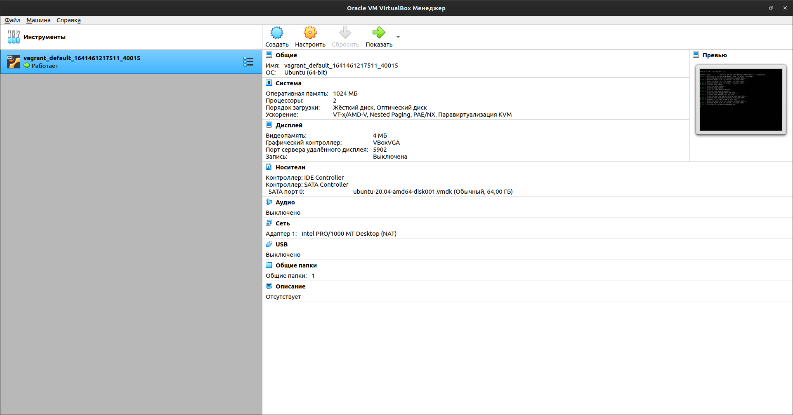
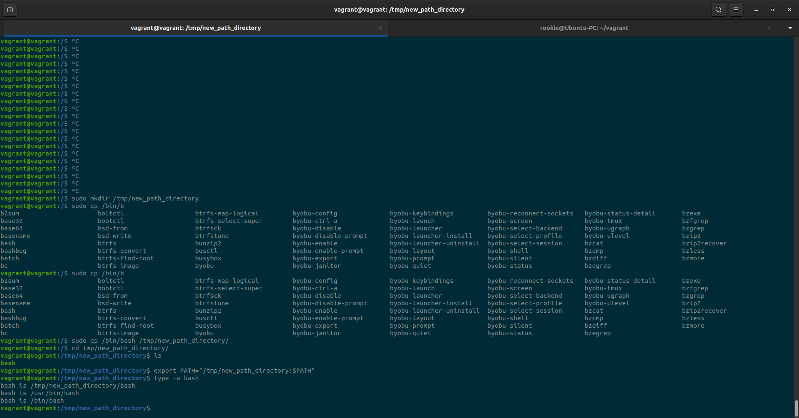

#Домашнее задание к занятию "Работа в терминале (лекция 1)"

1. Vagrant file:
   >Vagrant.configure("2") do |config|  
   config.vm.box = "bento/ubuntu-20.04"  
   end

1.1 Конфигурация виртуальной машины, созданной в соответсвие с конфигурацией:  
  

2. Добавление дополнительного объема оперативной памяти и ресурсов процессора виртуальной машине:  
Добавим в конфиг Vagranfile следующие строки:  

   config.vm.provider "virtualbox" do |v|  
   &ensp;&ensp;&ensp;v.memory = 2048  
   &ensp;&ensp;&ensp;v.cpus = 2  
   end

2.1 Конфигурация виртуальной машины, после внесения изменений в Vagrantfile:  

3. Ознакомиться с разделами man bash, почитать о настройках самого bash:  
   3.1 какой переменной можно задать длину журнала history, и на какой строчке manual это описывается?
   * man bash | grep -n HISTSIZE  
   * 628 HISTSIZE  
   
   3.2 что делает директива ignoreboth в bash?  
   * Эта директива является объединением двух директив "ignorespace" и "ignoredups" переменной HISTCONTROL  

   3.3 В каких сценариях использования применимы скобки {} и на какой строчке man bash это описано?  
   * Фигурные скобки применимы для группировки команд, чтобы они выполнялись как единое целое.
   * man bash | grep -n '{ list; }'
   * 205 { list; }
   
   3.4 С учётом ответа на предыдущий вопрос, как создать однократным вызовом touch 100000 файлов? Получится ли аналогичным образом создать 300000? Если нет, то почему?  
   * для создания 100000 файлов нужно выполнить команду, например:  touch file{1..100000}.tmp
   создать 300000 файлов не получится по причине ограничения количества inode в файловой системе  
   
   3.5 В man bash поищите по /\[\[. Что делает конструкция [[ -d /tmp ]]
   * конструкция [[ -d /tmp ]] возвращает 0 или 1 в зависимости от результата выполнения команды внутри скобок.  
   В нашем случае указан флаг -d, который возвращает True, если файл сущиествует и это директория.

Выполнение пункта 12:  
  

  3.6 Чем отличается планирование команд с помощью batch и at?  
  * at	позволяет пользователю планировать задачу
  * batch	указывает системе запускать задание только в указанное время, если загрузка системы находится на определенном уровне (средняя загрузка <1,5)  

   