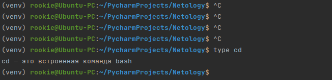
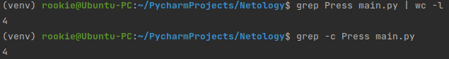
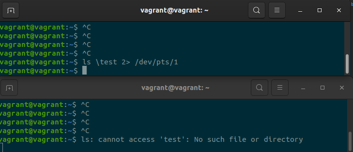
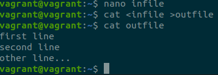
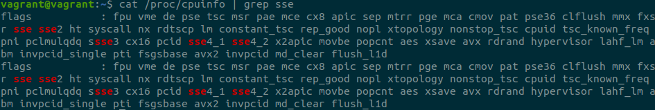
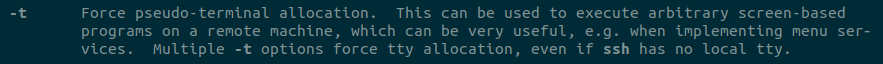
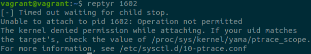

Домашнее задание к занятию "3.2. Работа в терминале, лекция 2"
=
1. cd - это встроенная команда bash
  
Так как команда cd уже встроенна в bash, при её выполнении не порождаются дочерние процеессы.  
Так же, по моему мнению, это может незначительно влиять на производительность, т.к. встроенные  
команды выполняются быстрее внешних и имеют прямой доступ к интерпретатору.
2. Альтернатива команде "grep <some_string> <some_file> | wc -l":  

3. Прародителем всех процессов в системе является процесс init (от англ. «initialization») — первая  
программа, которая выполняется при загрузке Linux и управляет всеми другими процессами в системе.  
init запускается самим ядром и всегда имеет PID = 1, поэтому у него в принципе нет родительского процесса.
4. Команда вывода stderr "ls" в другую сессию терминала будет выглядеть так:  
* ls \test 2> /dev/pts/1

5. Команда, передающая команде файл на stdin и выводит ее stdout в другой файл, выглядит так:  

6. Можно, например, отправить сообщение из pts/0 в tty, но результат не будет виден в рамках виртуальной машины.  
Если только выполнить передачу данных на хостовой системе(не в виртуальной машине) из /dev/pts/0 в tty3,  
а посмотреть результат, переключив сессию комбинацией клавиш "Ctrl+Alt+F3".
7. Команда "bash 5>&1" создаст новый файловый дескриптор для текущей сессии в /proc.
команда "echo netology > /proc/$$/fd/5" отправит stdout команды echo в только что созданный дескриптор "5"
8. Да можно, например так:  
* ls /test 9>&2 2>&1 1>&9 | grep cannot >&1  
9. Команда "cat /proc/$$/environ" выводит список переменных окружения текущего пользователя.  
Аналогичный по содержанию вывод можно получить, выполнив команду "printenv"
10. По адресу /proc/PID/cmdline доступны все аргументы, переданные ядру в момент старта системы.  
Адрес /proc/<PID>/exe указывает на бинарный файл запущенной команды, который представлен символической ссылкой.
11. Выполнив команду "cat /proc/cpuinfo | grep sse" получаем следующее:  
  
более старшая версия инструкций SSE процессора 4.2
12. Так происходит потому, что ожидается наличие интеркатива, а при выполнении скрипта ssh не выделяется TTY.  
Чтобы команда "ssh localhost 'tty'" выполнилась, нужно команде ssh передать параметр -t, тем самым принудительно  
выделить TTY. man ssh:  

13. После установки пакета reptyr и попытки захвата процесса, появилась ошибка:  

После установки значения
* /proc/sys/kernel/yama/ptrace_scope
равным 0, все сработало
14. Команда echo выводит в stdout переданный е аргумент, в то время как tee  
одновременно может передавать данные в файл и в переменную