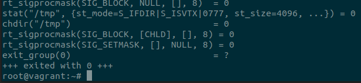
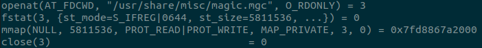
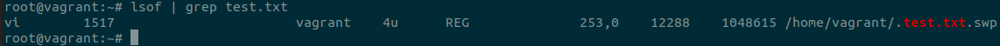
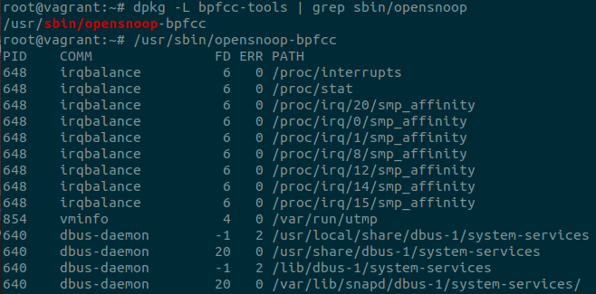
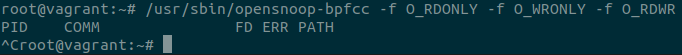
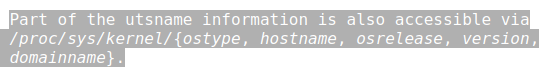
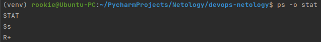

Домашнее задание к занятию "3.3. Операционные системы, лекция 1"
=
1. Системный вызов для команды ***strace /bin/bash -c 'cd /tmp' это chdir("/tmp")***  

2. База данных команды файл "file" находится в файле usr/share/misc/magic.mgc:

3. Порядок действий будет следующим(предварительно создал файл test.txt и в другой сессии  
терминала запустил vi):
 * sudo lsof | grep test.txt  
В выводе команды нам нужно узнать PID и файловый дескриптор(FD), например:  

Следующий шаг - очистка файла:
 * echo '' >/proc/1517/fd/4
4. Зомби не занимают памяти (как процессы-сироты), но блокируют записи в таблице  
процессов, размер которой ограничен для каждого пользователя и системы в целом. 
Зомби-процесс существует до тех пор, пока родительский процесс не прочитает  
его статус с помощью системного вызова wait(), в результате чего  
запись в таблице процессов будет освобождена.
5. В первые секунды работы команды, вывод был таким:

После этого, я почитал man по утилите opensnoop-bpfcc, и по пробовал запустить команду  
с фильтрами флагов, но в первые секунды так и не получил вывод в консоль:

6. Цитата по системному вызову:

[Источник](https://man7.org/linux/man-pages/man2/uname.2.html)
7. Отличия ";" от "&&" в том, что при разделении команд ";" выполнение команды после точки с запятой  
выполнится независимо от результата выполнения команды до точки с запятой. В случае с двойным амперсандом,  
команда идущая после него выполнится только в случае успешного выполнения команды, расположенной до двойного  
амперсанда. 
"set -e" немедленно завершит выполнение команд в конвейере, если хотя бы одна из команд вернет ненулевое значение.
Мне кажется, что конструкция нет смысла использовать "&&" вместе с  "set -e", т.к. при ненулевом результате выполнения  
одной из команд цепочке прекратится немедленно.
8. Режим bash "set -euxo pipefail" состоит из:
    * set - Установить или отменить значения опций оболочки и позиционных параметров;
    * e - Немедленный выход, если команда из цепочки вернула ненулевое значение;
    * u - Рассматривать неустановленные переменные как ошибку при замене;
    * x - вывести в консоль команды и их аргументы по ходу их выполнения;
    * o - имя параметра
    * pipefail - параметр, возвращающий значение конвейера - статус последней, которая вернула ненулевое значение  
   или ноль, если нет завершившихся команд с ненулевым статусом.
использование такого режима в скриптах удобно тем, что выполнение скрипта будет наглядно детализировано, например  
для выполнения логгирования, а так же сценарий будет завершен при наличии ненулевых статусов выполнения команд  
в конвейере, кроме выполнения самой последней команды.
9. Вывод команды "ps -o stat" в моем случае получился "немногословным":

* Ss - процесс, находящийся в "прерываемом сне"(ожидающий завершения события) - дословный перевод.
* R+ - R это запущенный или запускаемый процесс(в очереди на запуск), "+" означает, что процесс находится в группе процессов переднего плана.
