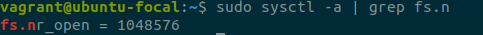

Домашняя работа к занятию "3.4. Операционные системы, лекция 2"
===
1. Node Exporter установлен. Проброшен порт в хостовую систему:

* создан unit файл, со следующим содержимым, а так же помещен в автозагрузку:

* Во внешнем файле "nexporter_env" размещена переменная USE_CFG, с помощью которой  
при запуске нашего сервиса передается опция "--web.listen-address=:9111"  

таким образом, наш сервис слушает порт "9111" в гостевой ОС, а с помощью опции "forwarded_port"  
в Vagrantfile я пробросил порт 9111 из гостевой ОС в порт 9100 на хостовой ОС.
* Сервис успешно запускается при старте системы(видно из скриншота выше),
успешно останавливается:

И после перезагрузки успешно запускается.

2. Опции, которые я бы выбрал для базового мониторинга системы:
* CPU
  * node_cpu_seconds_total
* Memory 
  * node_memory_MemAvailable_bytes
  * node_memory_MemFree_bytes
* Network
  * node_network_transmit_errs_total
  * node_network_transmit_bytes_total
  * node_network_receive_bytes_total
  * node_network_receive_errs_total

3. Установил netdata, в Vagrantfile добавил forwarded_port  
(таким же образом как и в первом пункте домашней работы), выполнил vagrant reload.  
Web интерфейс стал доступен на порту 19999:

4. Ответ: да можно  
  
5. sysctl fs.nr_open на системе по-умолчанию:

* "fs.nr_open" это лимит на количество открытых дескрипторов.
* другой существующий лимит, который не позволит достичь такого числа,  
можно узнать с помощью команды ulimit -S (мягкий лимит) и ulimit -H(жесткий лимит)  
Так же можно в процессе работы изменить soft лимит, например "ulimit -S 31150"
6. Ответ:  

7. :(){ :|:& };: - Это fork бомба. О ней говорилось в лекции))
после запуска и ожидания, ssh сессия оборвалась, после повторного подключения  
и запуска команды dmesg, я увидел следующее:

Полагаю, что помог oom-kill, а число процессов можно ограничить командой ulimit -u 100  
Это означает, что для пользователя установлен лимит в 100 процессов.
Дополнение к ответу на 7й вопрос:
   * в выводе dmesg нас интересует строка с cgroup:
  
в стабилизации системы помог механизм ядра cgroup. это механизм Linux для установки ограничений  
на системные ресурсы, такие как максимальное количество процессов, циклы процессора,  
использование оперативной памяти и т.д., а число процессов можно ограничить командой ulimit -u 100  
Это означает, что для пользователя установлен лимит в 100 процессов.
