Домашняя работа к занятию "3.5. Файловые системы"
=

1. Узнайте о sparse (разряженных) файлах.
Ознакомился, не подозревал, что разреженные файлы используются в виртуальных машинах при создании образов дисков. Интересная информация!

2. Могут ли файлы, являющиеся жесткой ссылкой на один объект, иметь разные права доступа и владельца? Почему?
Нет, так как hard link, в отличие от symbolyc link, являются одним и тем же объектом файловой системы и ссылается на один и тот же индексный номер(inode) имеет тот же набор прав дсотупа как и у исходного файла:
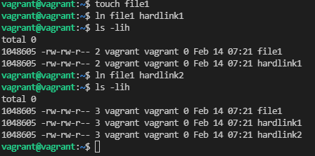  
Напротив, symbolyc link указывает не на сам файл, а на его имя(путь), а при создании symbolyc link создается новый объект файловой системы с новыйм inode с новыми правами доступа:  
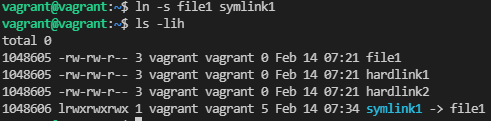  

3. Сделайте vagrant destroy на имеющийся инстанс Ubuntu. Замените содержимое Vagrantfile следующим:
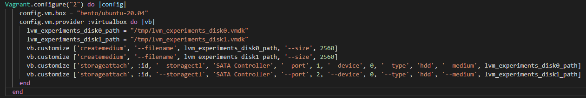  
Виртуальная машина создана.
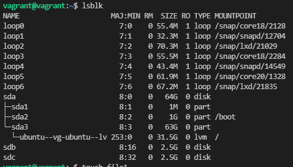  

4. Используя fdisk, разбейте первый диск на 2 раздела: 2 Гб, оставшееся пространство.  
   * Выполнено:  
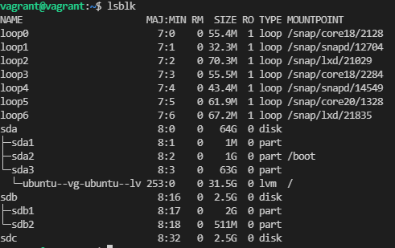  

5. Используя sfdisk, перенесите данную таблицу разделов на второй диск.
   * Выполнено:  
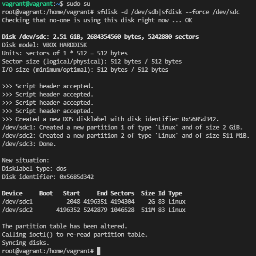  

6. Соберите mdadm RAID1 на паре разделов 2 Гб.  
   * Выполнено:
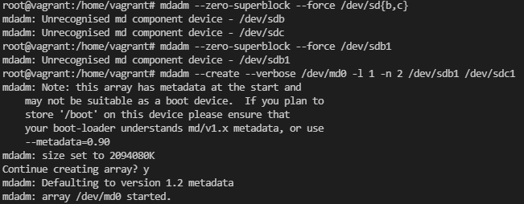

7. Соберите mdadm RAID0 на второй паре маленьких разделов.  
   * Выполнено:
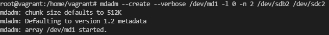

8. Создайте 2 независимых PV на получившихся md-устройствах.  
   * Выполенено:  
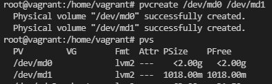  

9. Создайте общую volume-group на этих двух PV.  
   * Выполнено:  
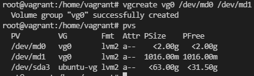  

10. Создайте LV размером 100 Мб, указав его расположение на PV с RAID0.  
    * Выполенено:  
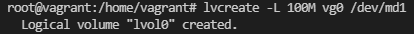  
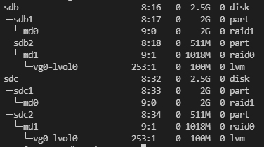  

11. Создайте mkfs.ext4 ФС на получившемся LV.  
    * Выполнено:  
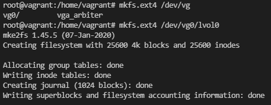  

12. Смонтируйте этот раздел в любую директорию, например, /tmp/new.  
    * Выполнено:  
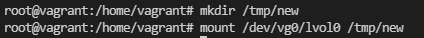  

13. Поместите туда тестовый файл, например wget https://mirror.yandex.ru/ubuntu/ls-lR.gz -O /tmp/new/test.gz.  
    * Выполенено:
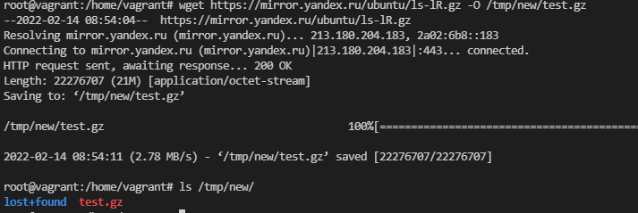  

14. Прикрепите вывод lsblk.  
    * Выполнено:  
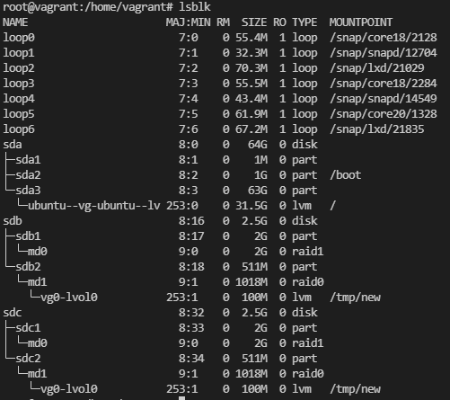  

15. Протестируйте целостность файла:  
    * Выполнено:  
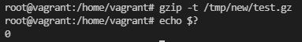  

16. Используя pvmove, переместите содержимое PV с RAID0 на RAID1.  
    * Выполнено:  
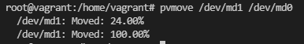  

17. Сделайте --fail на устройство в вашем RAID1 md.  
    * Выполнено:  
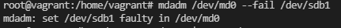  

18. Подтвердите выводом dmesg, что RAID1 работает в деградированном состоянии.  
    * Выполнено:
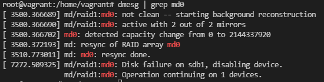  

19. Протестируйте целостность файла, несмотря на "сбойный" диск он должен продолжать быть доступен:  
    * Выполнено:  
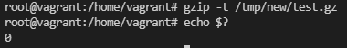  

20. Погасите тестовый хост, vagrant destroy.
    * Выполнено.  