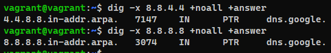

Домашняя работа к занятию "3.6. Компьютерные сети, лекция 1"  
=  

1. Работа c HTTP через телнет.  
   * Подключитесь утилитой телнет к сайту stackoverflow.com telnet stackoverflow.com 80;
   * отправьте HTTP запрос  

*   
* Код состояния HTTP 301 или Moved Permanently — стандартный код ответа HTTP, получаемый в ответ от сервера в ситуации, когда запрошенный ресурс был на постоянной основе перемещён в новое месторасположение, и указывающий на то, что текущие ссылки, использующие данный URL, должны быть обновлены.

2. Повторите задание 1 в браузере, используя консоль разработчика F12.  
   * откройте вкладку Network
   * отправьте запрос <http://stackoverflow.com>
   * найдите первый ответ HTTP сервера, откройте вкладку Headers
   * укажите в ответе полученный HTTP код.  
     * 
   * проверьте время загрузки страницы, какой запрос обрабатывался дольше всего?  
     * Waiting TTFB - 146,90 ms (время получение первого байта)
   * приложите скриншот консоли браузера в ответ.
     *   

3. Какой IP адрес у вас в интернете?  
   * 92.255.235.100 - с помощью сайта 2ip  

4. Какому провайдеру принадлежит ваш IP адрес? Какой автономной системе AS? Воспользуйтесь утилитой whois.
   * Провайдер "ER-Telecom Holding"
   * Принадлежит автономной системе AS41727  
 * 

5. Через какие сети проходит пакет, отправленный с вашего компьютера на адрес 8.8.8.8? Через какие AS? Воспользуйтесь утилитой traceroute.

 *   
* 1-шлюз вирутальной сети VBox, 2-сетевой интерфейс хостовой системы,  
3 - 6 сети холдинга ER-Telecom, 7 - 21 сети корпорации Google LLC
* В логе команды Traceroute присутствуют 3 автонономные системы:  
    * AS41727
    * AS9049
    * AS15169

6. Повторите задание 5 в утилите mtr. На каком участке наибольшая задержка - delay?
   *   
 * Самая большая задержка отмечена на шлюзе компании Google 74.125.244.133

7. Какие DNS сервера отвечают за доменное имя dns.google? Какие A записи? воспользуйтесь утилитой dig.
   * NS сервера отвечающие за доменное имя dns.google:
  

   * A записи:  
  

8. Проверьте PTR записи для IP адресов из задания 7. Какое доменное имя привязано к IP? воспользуйтесь утилитой dig.
   * 8.8.8.8 - ptr запись 8.8.8.8.in-addr.arpa.
   * 8.8.4.4 - ptr запись 4.4.8.8.in-addr.arpa.
   * к IP привязано имя dns.google.  
  