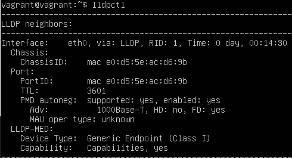
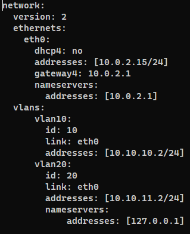
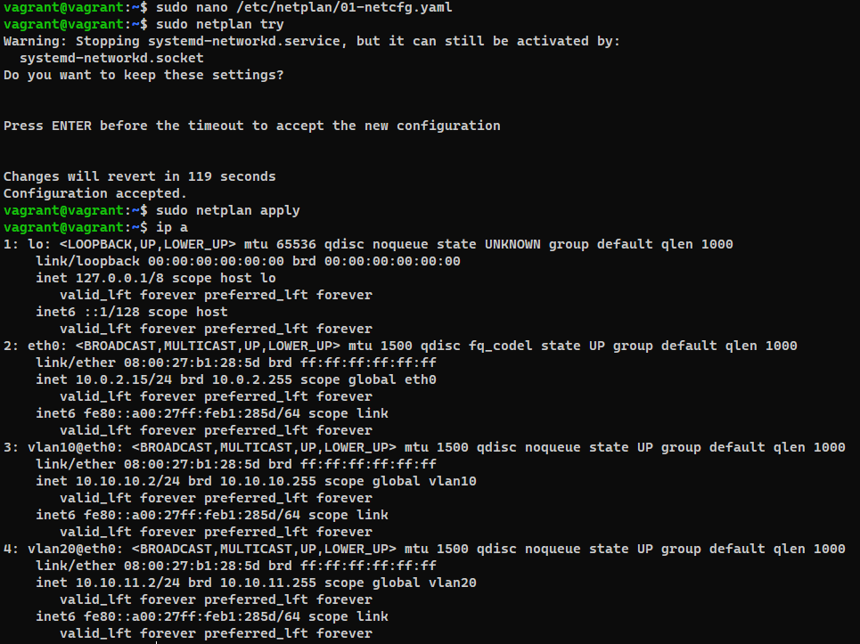
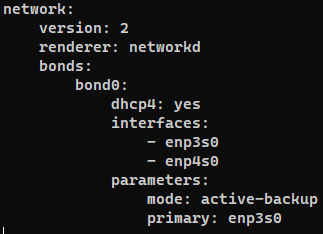
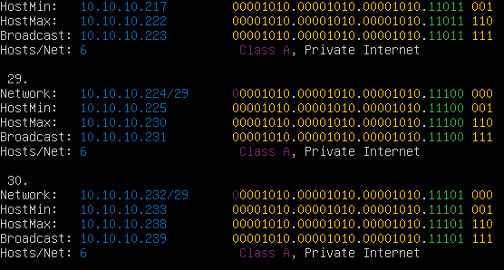

Домашняя работа к занятию "3.7. Компьютерные сети, лекция 2"
=

1. Проверьте список доступных сетевых интерфейсов на вашем компьютере. Какие команды есть для этого в Linux и в Windows?  
    * Команды Linux:  
        * ifconfig -a (deprecated)
        * ip address (с появлением Netplan)
        * netstat -i  
        * ip link show
        * ip a
    * Команды Windows:  
        * ipconfig /all  
        * Get-NetAdapter(командлет в PowerShell)  
        * wmic nic
        * netsh interface show interface  

2. Какой протокол используется для распознавания соседа по сетевому интерфейсу? Какой пакет и команды есть в Linux для этого?
    * Для распознавания соседа по сетевому интерфейсу используется протокол LLDP
    * в Linux существует пакет lldpd. Для запуска и просмотра соседа по сетевому интерйесу, после утсновки в консоли нужно выполнить 'lldpctl'
    * 

3. Какая технология используется для разделения L2 коммутатора на несколько виртуальных сетей? Какой пакет и команды есть в Linux для этого? Приведите пример конфига.
    * Для разделения L2 коммутатора на несколько виртуальных сетей применяется  технология VLAN.
    * для настройки VLAN в Linux есть пакет "vlan". Так же, настройку можно провести с помощью netplan. Например:
        *   
        * Результат настройки:
        *   

4. Какие типы агрегации интерфейсов есть в Linux? Какие опции есть для балансировки нагрузки? Приведите пример конфига.
     * типы агрегации интерфейсов в Linux:
        * Mode-0(balance-rr) - балансировка и отказоустойчивость;
        * Mode-1(active-backup) - один интерфейс активен, остальные в режиме ожидания;
        * Mode-2(balance-xor) - Передача пакетов распределяется по типу входящего и исходящего трафика по формуле ((MAC src) XOR (MAC dest)) % число интерфейсов;
        * Mode-3(broadcast) – Происходит передача во все объединенные интерфейсы;
        * Mode-4(802.3ad) – динамическое объединение одинаковых портов;
        * Mode-5(balance-tlb) – Адаптивная балансировки нагрузки трафика;
        * Mode-6(balance-alb) – Адаптивная балансировка нагрузки. Отличается более совершенным алгоритмом балансировки нагрузки чем Mode-5);  
     * Пример конфигурации(Netplan):
     *   

5. Сколько IP адресов в сети с маской /29 ? Сколько /29 подсетей можно получить из сети с маской /24. Приведите несколько примеров /29 подсетей внутри сети 10.10.10.0/24.
     * В сети с маской /29 существует 6 хостов;  
     * В сети с маской /24 можно получить 32 подсети с маской /29; (с помощью команды ipcalc 192.168.1.0/24 /29); 
     * Примеры подсетей с маской /29:
          *   

6. Задача: вас попросили организовать стык между 2-мя организациями. Диапазоны 10.0.0.0/8, 172.16.0.0/12, 192.168.0.0/16 уже заняты. Из какой подсети допустимо взять частные IP адреса? Маску выберите из расчета максимум 40-50 хостов внутри подсети.
   * допустимо использовать адреса из 100.64.0.0 с маской /26;