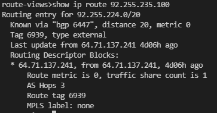
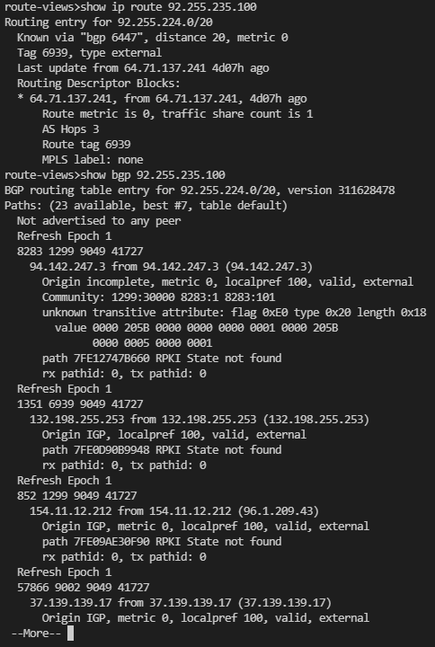
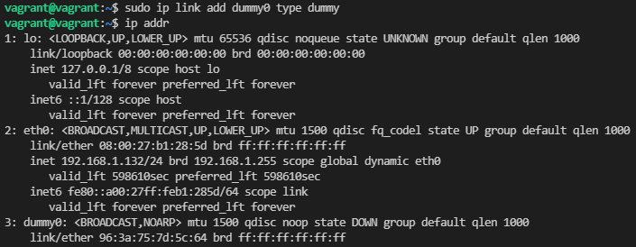
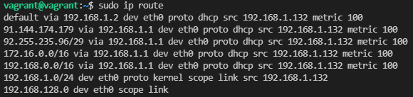
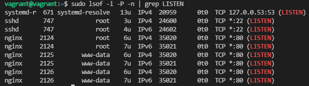
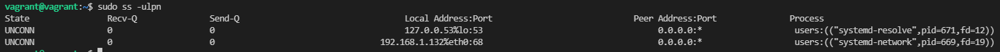

Домашняя работа к занятию "3.8. Компьютерные сети, лекция 3"
=
1. Подключитесь к публичному маршрутизатору в интернет. Найдите маршрут к вашему публичному IP.  
- show ip route  

- show bgp  
  

2. Создайте dummy0 интерфейс в Ubuntu. Добавьте несколько статических маршрутов. Проверьте таблицу маршрутизации.  
- sudo ip link add dummy0 type dummy

- sudo ip addr add 192.168.128.2 dev dummy0  
- sudo ip route add 192.168.128.0/32 dev eth0  
  

3. Проверьте открытые TCP порты в Ubuntu, какие протоколы и приложения используют эти порты? Приведите несколько примеров.  
- Открытые порты в виртуальной машине:

В моей ВМ открыты:
- 53 порт - на этом порту работает служба systemd-resolve, выполняющая  разрешение сетевых имен для локальных приложений;
- 22 - этот порт слушает сервис sshd для входящих подключений по протоколу SSH 
- 80 - этот порт слушает сервис Nginx для входящих подключений по протоколу HTTP.  

4. Проверьте используемые UDP сокеты в Ubuntu, какие протоколы и приложения используют эти порты?

- UDP порт 68 - использует демон для управления сетевыми настройками systemd-network, BOOTPC (Bootstrap Protocol Client) — для клиентов бездисковых рабочих станций, загружающихся с сервера BOOTP; также используется DHCP  
- UDP порт 53 - локальный демон DNS, порт испульзуется для отправки запросов на DNS сервер.

5. Используя diagrams.net, создайте L3 диаграмму вашей домашней сети или любой другой сети, с которой вы работали.
   - Диаграмма домашней сети [Home_Net_Diagram.drawio](https://github.com/PlotnikovAlexandr/devops-netology/blob/b273bed9f39d2dcc189aa70db77a1b21a396897e/03-sysadmin-08-net/Home_net_Diagram.drawio)