Домашняя работа к занятию "3.9. Элементы безопасности информационных систем"
=
1. Установите Bitwarden плагин для браузера. Зарегестрируйтесь и сохраните несколько паролей.
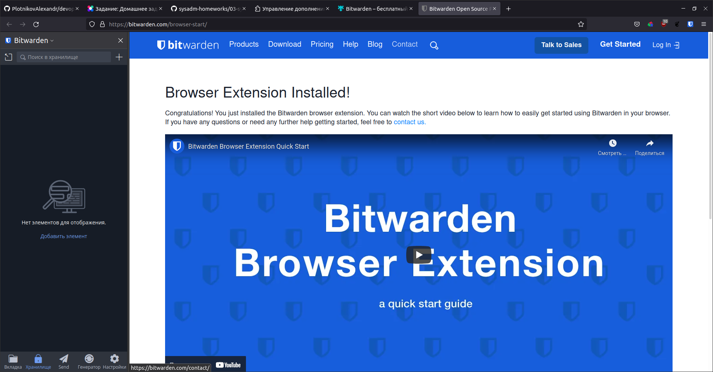
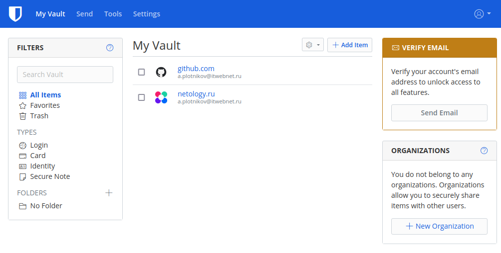
2. Установите Google authenticator на мобильный телефон. Настройте вход в Bitwarden акаунт через Google authenticator OTP.
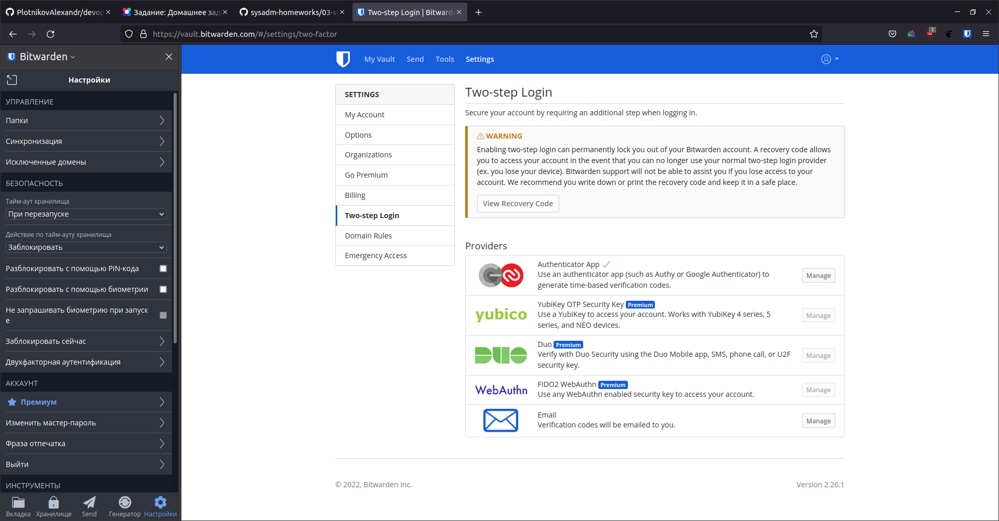
3. Установите apache2, сгенерируйте самоподписанный сертификат, настройте тестовый сайт для работы по HTTPS.
    * Устанавливаем Apache2 - sudo apt install apache2
    * Включаем SSL - sudo a2enmod ssl
    * Генерируем сертификат:
        * sudo openssl req -x509 -nodes -days 365 -newkey rsa:2048 -keyout /etc/ssl/private/apache-selfsigned.key -out /etc/ssl/certs/apache-selfsigned.crt
    * Создаем конфиг для нового virtual-host:
        * sudo nano /etc/apache2/sites-available/testsite.conf
    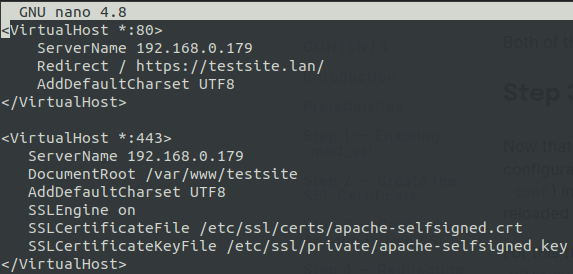
    * Созадем тестовую страницу:
    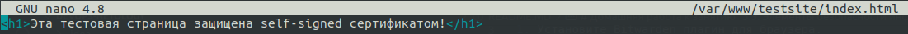
    * Включаем нашу конфигурацию - sudo a2ensite testsite.conf
    * Проверяем правильность конфигурации - sudo apache2ctl configtest
    * Перечитывем конфигурацию Apache2 - sudo systemctl reload apache2
    * Переходим по адресу https://testsite.lan
    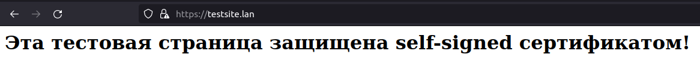
    * Просмотр сертификата сайта:
    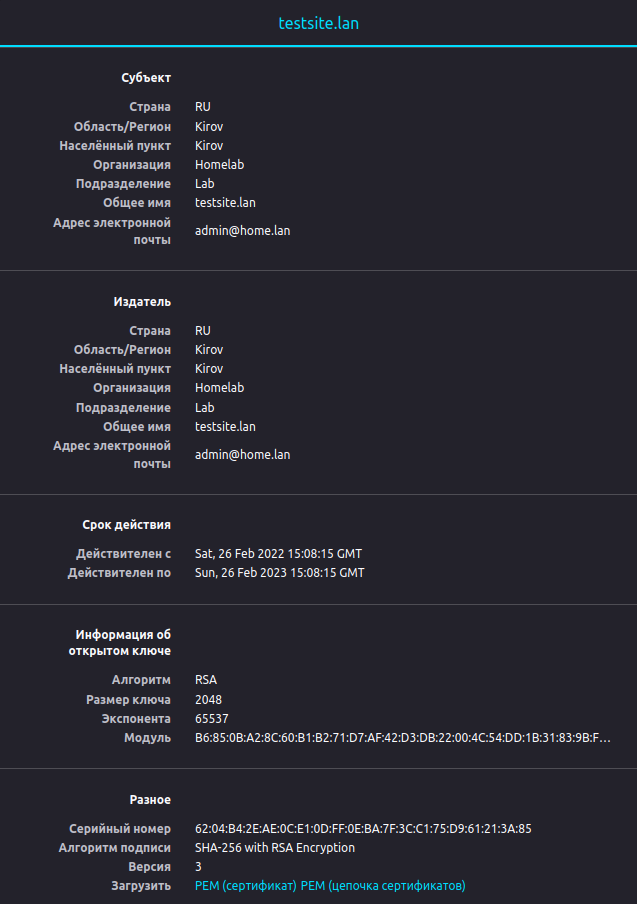
4. Проверьте на TLS уязвимости произвольный сайт в интернете (кроме сайтов МВД, ФСБ, МинОбр, НацБанк, РосКосмос, РосАтом, РосНАНО и любых госкомпаний, объектов КИИ, ВПК ... и тому подобное).
    * 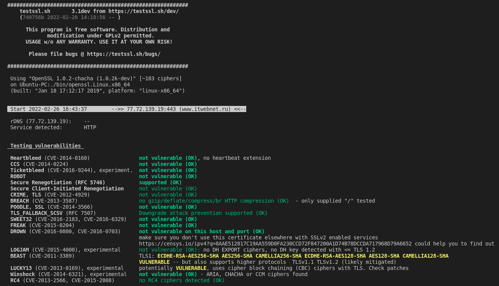
5. Установите на Ubuntu ssh сервер, сгенерируйте новый приватный ключ. Скопируйте свой публичный ключ на другой сервер. Подключитесь к серверу по SSH-ключу.
    * в моей домашней лаборатории уже настроен данный механизм:
    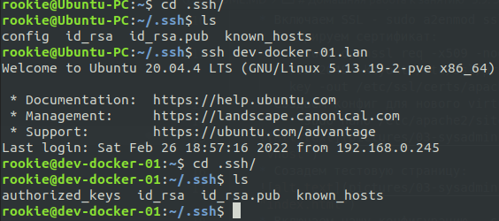
6. Переименуйте файлы ключей из задания 5. Настройте файл конфигурации SSH клиента, так чтобы вход на удаленный сервер осуществлялся по имени сервера.
    * 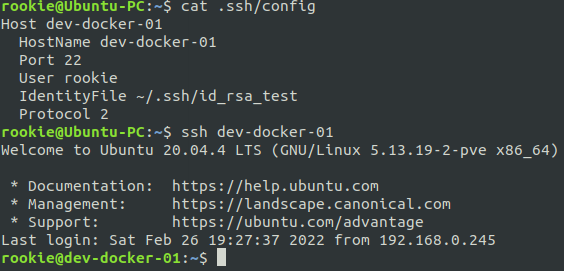
7. Соберите дамп трафика утилитой tcpdump в формате pcap, 100 пакетов. Откройте файл pcap в Wireshark.
    * sudo tcpdump -w 0001.pcap -c 100 -i eth0
    * scp 0001.pcap sshuser@Ubuntu-PC:/tmp
    * Открываем файл 0001.pcap с помощью Wireshark:
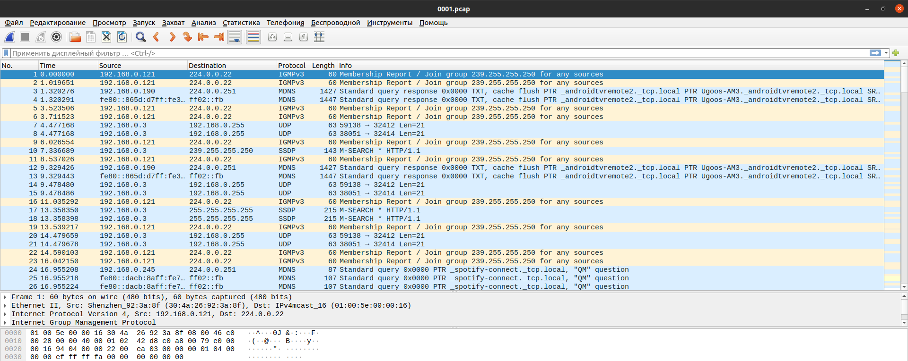