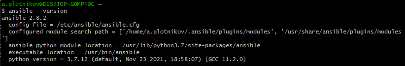
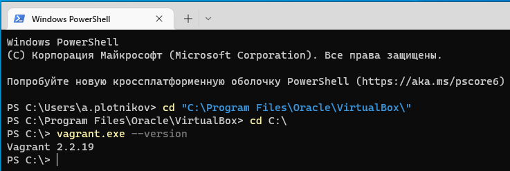
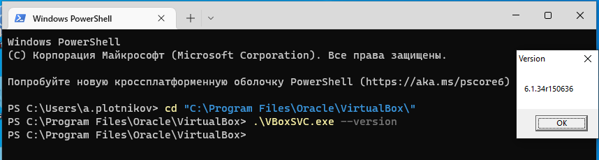

Домашнее задание к занятию "5.2. Применение принципов IaaC в работе с виртуальными машинами"
==
Задача 1
==
Опишите своими словами основные преимущества применения на практике IaaC паттернов.
Какой из принципов IaaC является основополагающим?

Ответ:
--
- отказ от ручного развертывания инфраструктуры
- быстрое восстановление после сбоев, за счет поиска ошибок в конфигурациях
- каждый раз единица инфраструктуры развертывается одинаково
- быстрая модификация ресурсов для инфраструктуры

Задача 2
==
Чем Ansible выгодно отличается от других систем управление конфигурациями?
Какой, на ваш взгляд, метод работы систем конфигурации более надёжный push или pull?

Ответ:
--
- Ansible, в отличие от других систем, не использует агента на целевых серверах, все действия происходят через ssh
- Push конфигурация более надежная, т.к. безопасность секретов обеспечивается Git и пайплайном сборки. 

Задача 3
==
Установить на личный компьютер:

- VirtualBox
- Vagrant
- Ansible

Приложить вывод команд установленных версий каждой из программ, оформленный в markdown.

Ответ:
--
- Ansible version

- Vagrant version

- VirtualBox version
