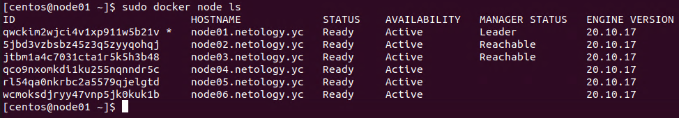
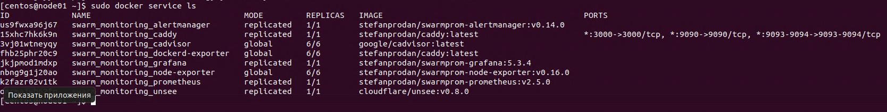

Домашняя работа к занятию "5.5. Оркестрация кластером Docker контейнеров на примере Docker Swarm"
==

Задача 1
--
Дайте письменые ответы на следующие вопросы:

- В чём отличие режимов работы сервисов в Docker Swarm кластере: replication и global?
- Какой алгоритм выбора лидера используется в Docker Swarm кластере?
- Что такое Overlay Network?

Ответ:
-
 - Отличие replicated от global в том, что режим global гарантирует выполнение одной реплики какого-то сервиса на каждом узле кластера, то же самое можно сказать и про режим replicated, но для этого режима указывается количество реплик сервиса.
 - в Docker Swarm используется алгоритм Raft Consensus Algorithm
 - Overlay Network это сеть, в которой несколько физических хостов с Docker связаны виртуальной сетью, которую используют контейнеры для обеспечения связи между друг другом. 

Задача 2
--
Создать ваш первый Docker Swarm кластер в Яндекс.Облаке

Для получения зачета, вам необходимо предоставить скриншот из терминала (консоли), с выводом команды:

        docker node ls

Ответ:
- 

Задача 3
--
Создать ваш первый, готовый к боевой эксплуатации кластер мониторинга, состоящий из стека микросервисов.

Для получения зачета, вам необходимо предоставить скриншот из терминала (консоли), с выводом команды:

        docker service ls

Ответ:
-

