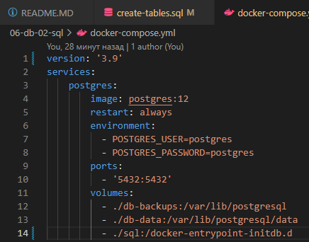
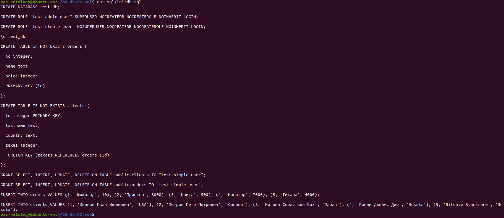
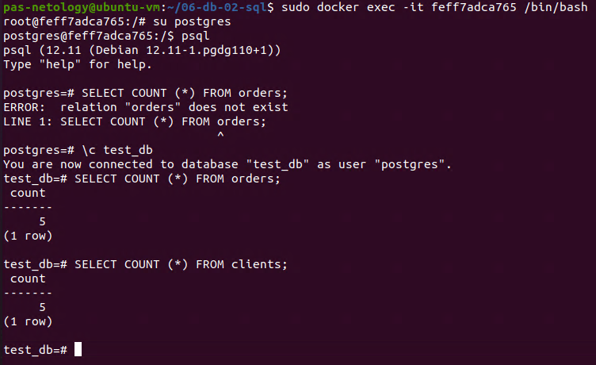
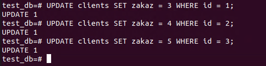
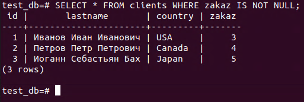
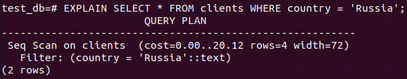
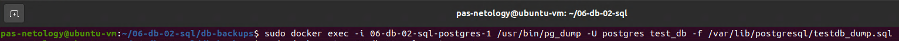
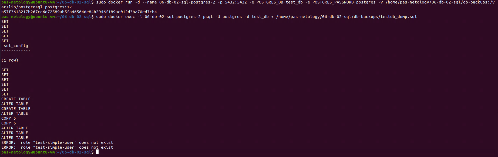

Домашняя работа к занятию "6.2. SQL"
==
Задача 1. Ответ:
--

Задача 2, 3. Ответ:
--
Я взял на себя смелость добавить выполнение задач в Init скрипт, примонтированный к контейнеру:

Количество записей каждой таблицы:

Задача 4. Ответ:
--
Связи, согласно ДЗ

SQL-запрос для выдачи всех пользователей, которые совершили заказ

Задача 5. Ответ:

 Этот запрос выполняет последовательное чтение данных из таблицы clients с фильтром по стране клиента, показывая затрантность операции(cost), количество возвращаемых строк(rows) и средний размер строки в байтах(width).

 Задача 6. Ответ:
 Создаем бэкап
 
 Останавливаем первый контейнер и:
 