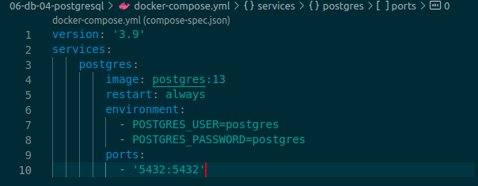
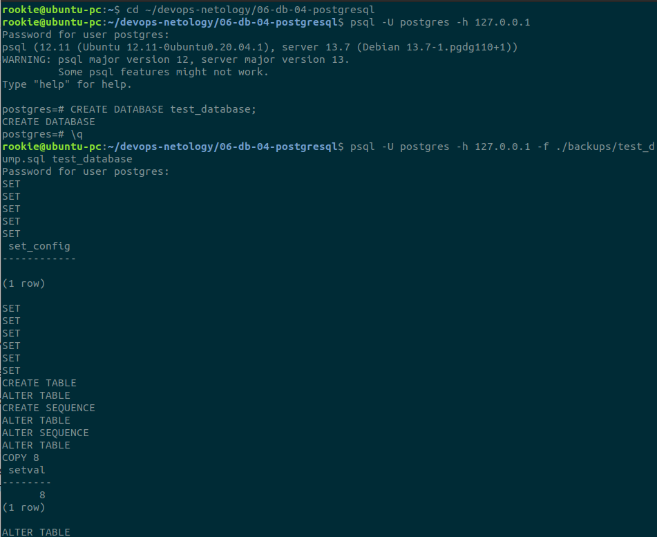
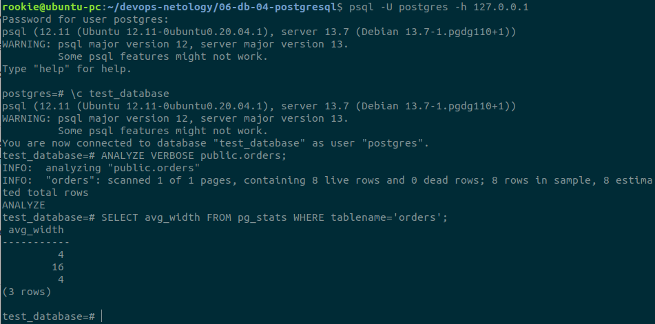
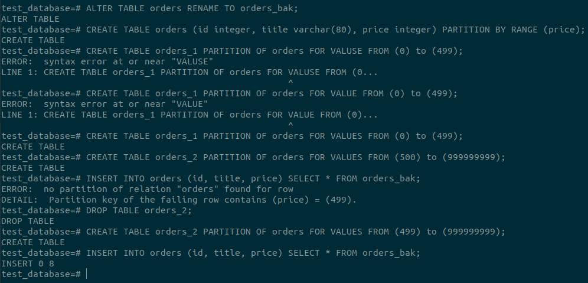
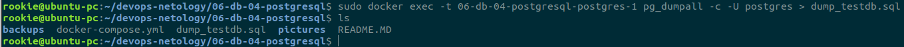

Домашняя работа к занятию "6.4. PostgreSQL"
==
Задача 1. Ответ:
-
- Поднял контейнер с помощью docker-compose:

Список команд по заданию:
- вывода списка БД - \l
- подключения к БД - \c 'database name'
- вывода списка таблиц - \dtS - т.к. в бд есть только системные таблицы
- вывода описания содержимого таблиц - \dS+ pg_am (в нашем случае, по той же причине, что и команда выше)
- выхода из psql - \q

Задача 2. Ответ:
-

Задача 3. Ответ:
-
Пользовался статьей с Habr. https://habr.com/ru/post/273933/

Можно было избежать этих манипуляций, если бы при создании бд использовали секционирование по интервалу.

Задача 4. Ответ:
-
Бэкап базы данных:

Как бы вы доработали бэкап-файл, чтобы добавить уникальность значения столбца title для таблиц test_database?

Я бы исппользовал уникальное ограничение:
- CONSTRAINT constraint_titles UNIQUE (title)