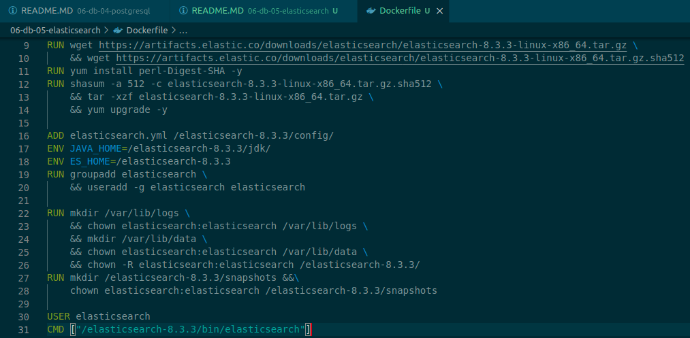
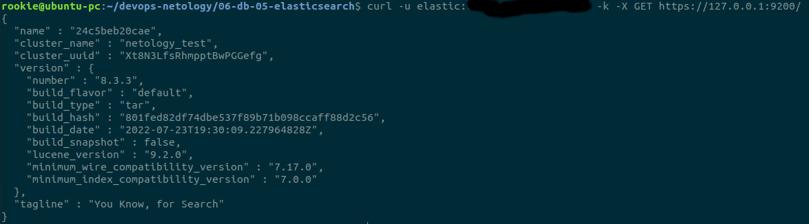
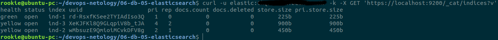
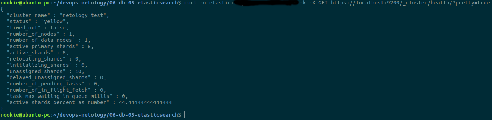
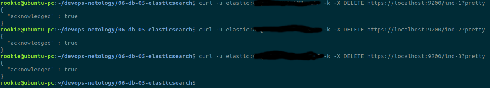
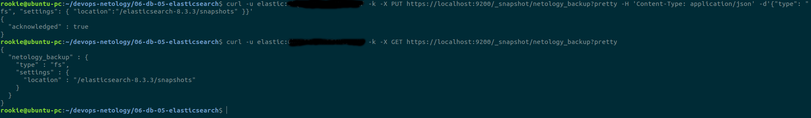
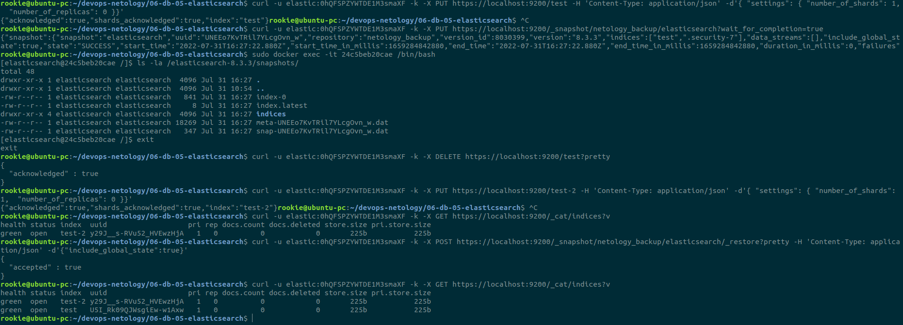

Домашняя работа к занятию "6.5. Elasticsearch".
==
Задача 1. Ответ:
-

Образ в Docker Hub 
- https://hub.docker.com/repository/docker/alexcarpenters/elastic

Ответ elasticsearch на запрос пути / в json виде:

Elasticsearch.yaml: в репозитории github

Задача 2. Ответ:
-
Создаем индексы:
- curl -u elastic:0hQFSPZYWTDE1M3smaXF -k -X PUT https://localhost:9200/ind-1 -H 'Content-Type: application/json' -d'{ "settings": {{ "number_of_shards": 1,  "number_of_replicas": 0 }}'
- curl -u elastic:0hQFSPZYWTDE1M3smaXF -k -X PUT https://localhost:9200/ind-2 -H 'Content-Type: application/json' -d'{ "settings": { "number_of_shards": 2,  "number_of_replicas": 1 }}'
- curl -u elastic:0hQFSPZYWTDE1M3smaXF -k -X PUT https://localhost:9200/ind-3 -H 'Content-Type: application/json' -d'{ "settings": { "number_of_shards": 4,  "number_of_replicas": 2 }}'

- Список созданных индексов:

- Статус кластера:

- Удаление индексов:

Статусы индексов Yellow говорят о том, что мы создали их с указанием количества реплик, а т.к. в кластере у нас одна нода, то реплицировать индексы некуда.

Задача 3. Ответ:
- Используя API зарегистрируйте данную директорию как snapshot repository c именем netology_backup.
- Приведите в ответе запрос API и результат вызова API для создания репозитория.

- Создайте индекс test с 0 реплик и 1 шардом и приведите в ответе список индексов.
- Создайте snapshot состояния кластера elasticsearch.
- Приведите в ответе список файлов в директории со snapshotами.
- Удалите индекс test и создайте индекс test-2. Приведите в ответе список индексов.
- Восстановите состояние кластера elasticsearch из snapshot, созданного ранее.
- Приведите в ответе запрос к API восстановления и итоговый список индексов.
