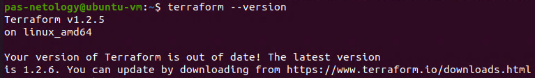
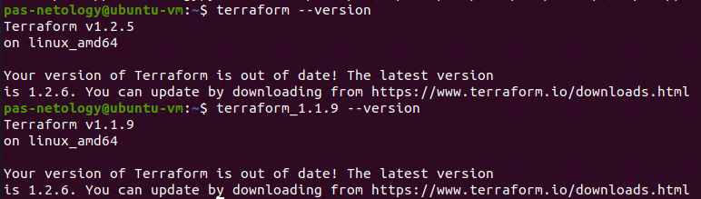

Домашняя работа к занятию "7.1. Инфраструктура как код"
==
Задача 1.
1) Какой тип инфраструктуры будем использовать для этого проекта: изменяемый или не изменяемый?
2) Будет ли центральный сервер для управления инфраструктурой?
3) Будут ли агенты на серверах?
4) Будут ли использованы средства для управления конфигурацией или инициализации ресурсов?

Ответ:
1) На первых порах, пока идет разработка и тестирование нового проекта, инфраструктуру можно использовать изменяемую, после первого стабитльного релиза - неизменяемую.
2) Считаю, что нужно использовать менджемент-сервер для запуска плейбуков Ansible, а так же для централизованного хранение всех скриптов. Так будет проще управлять инфраструктурой в начале имея 1 стартовый узел.
3) Агенты определенно будут, т.к. для автоматизации используется Teamcity.
4) Да, т.к. в компании уже используется Ansible, Terraform и Packer.

Отвечая на последние два вопроса(2,3), могу сказать что все будет зависеть от требований к новому проекту со стороны бизнеса, а так же готовности команды использовать новые инструементы в своей работе. Так же дополнительно требуется выяснить, на каких мощностях будет развернут наш проект.

Задача 2. Ответ:

Задача 3. Ответ:
