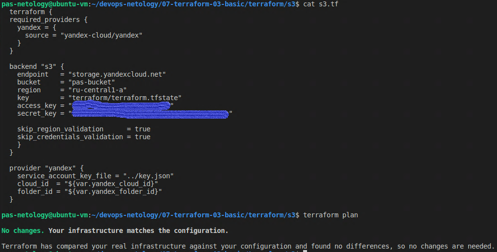
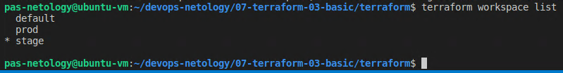
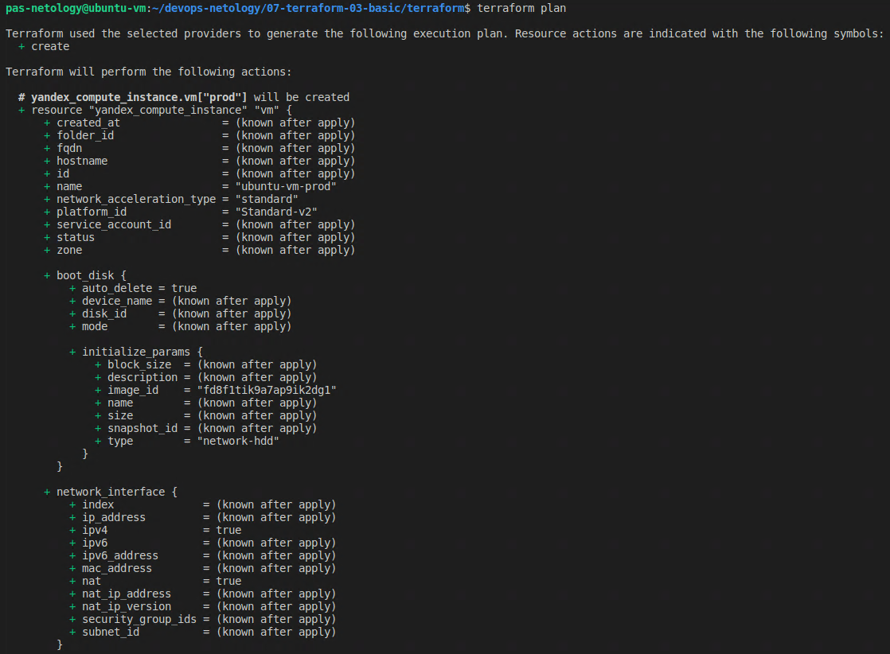
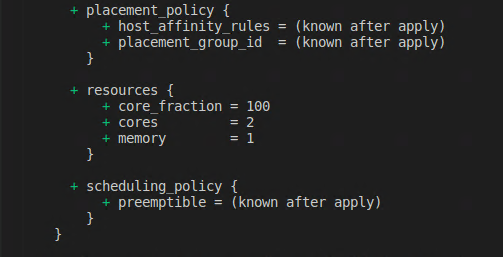

Домашняя работа к занятию "7.3. Основы и принцип работы Терраформ"
==
Задача 1. Ответ:
-
Создал s3 хранилище и зарегистрировал бэкэнд в Yndex Cloud с помощью терраформ

Задача 2. Ответ:
-
- Вывод команды terraform workspace list:

- Вывод команды terraform plan для воркспейса prod:

(Вывод terraform plan не поместился полностью, пришлось двумя скриншотами делать ответ)