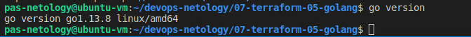
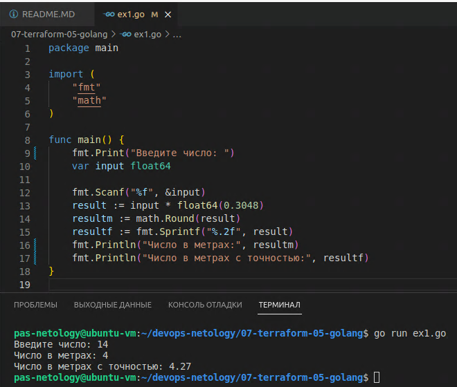
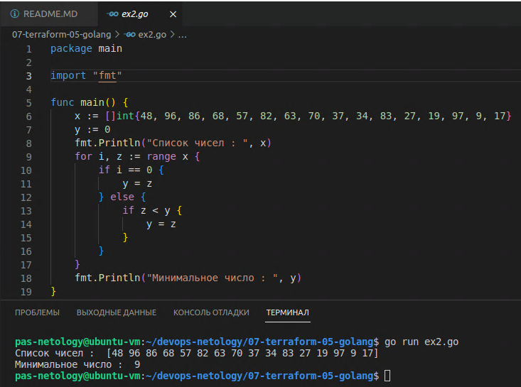
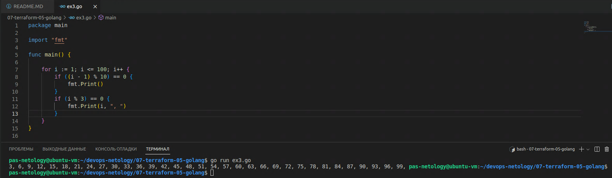

Домашняя работа к занятию "7.5. Основы golang"
==
Задача 1. Ответ:
-

Задача 2. Ответ:
-
Посмотрел и попробовал консоль в действии.

Задача 3. Ответ:
- Напишите программу для перевода метров в футы (1 фут = 0.3048 метр). Можно запросить исходные данные у пользователя, а можно статически задать в коде. Для взаимодействия с пользователем можно использовать функцию Scanf:

- Напишите программу, которая найдет наименьший элемент в любом заданном списке, например:
x := []int{48,96,86,68,57,82,63,70,37,34,83,27,19,97,9,17,}

- Напишите программу, которая выводит числа от 1 до 100, которые делятся на 3. То есть (3, 6, 9, …)

Ссылка на репозиторий с кодом https://github.com/PlotnikovAlexandr/devops-netology/tree/main/07-terraform-05-golang