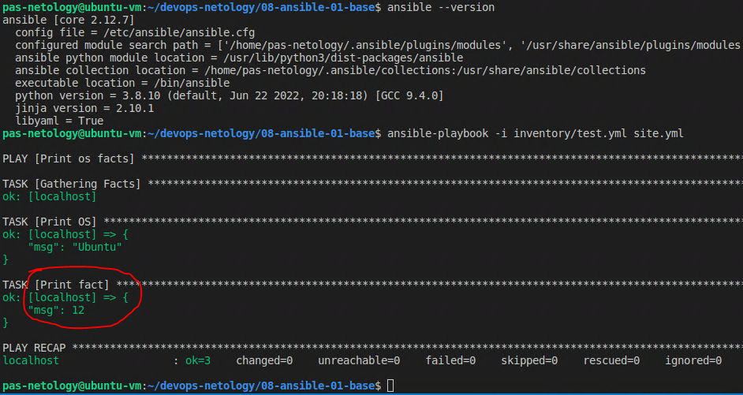
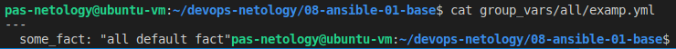
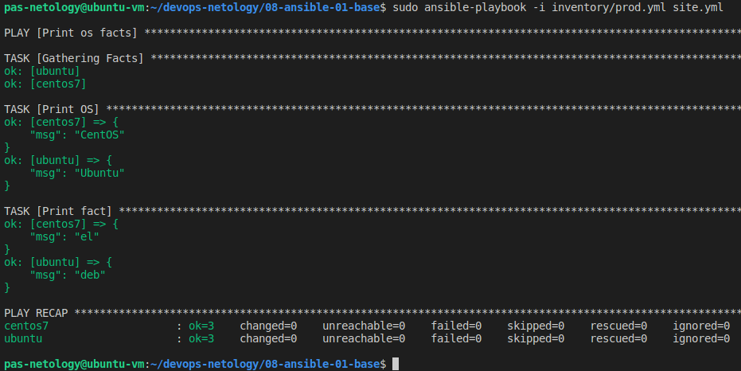
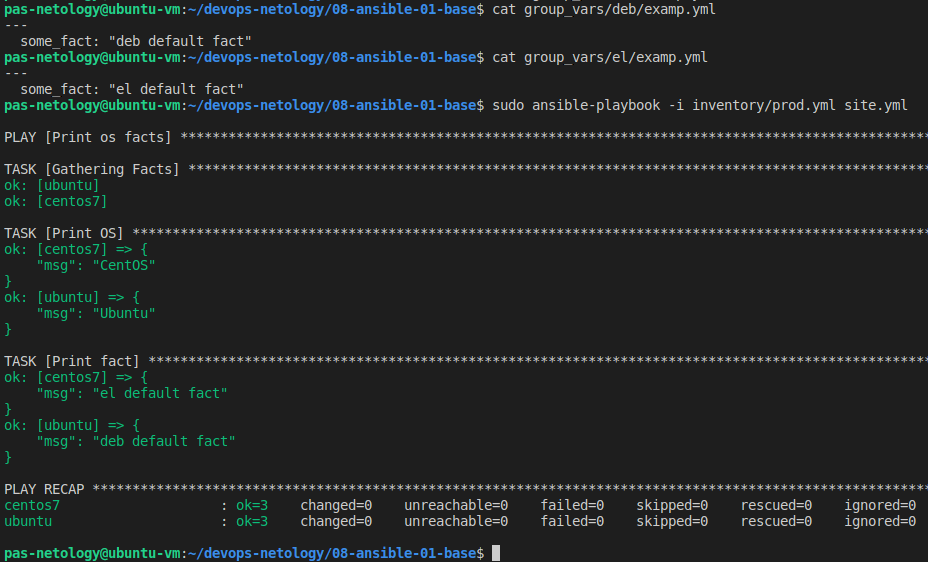
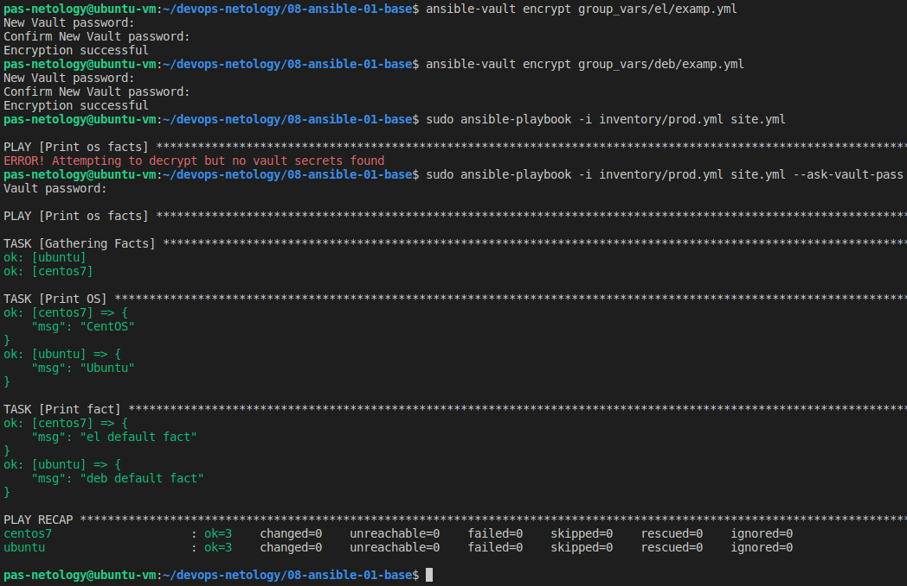
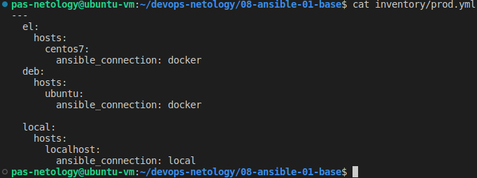
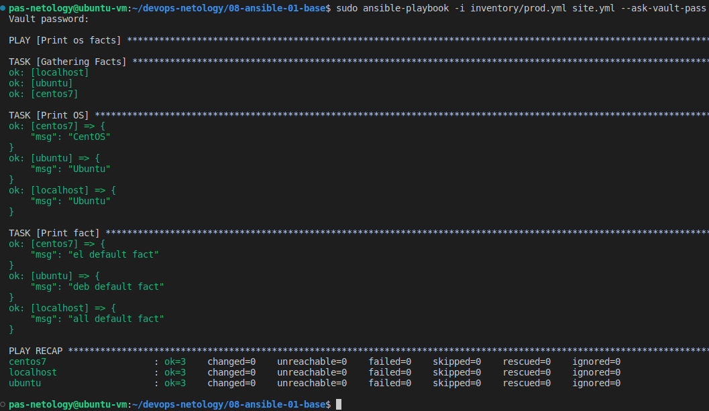

Домашняя работа к занятию "08.01 Введение в Ansible"
==
Основная часть.
-
1) Попробуйте запустить playbook на окружении из test.yml, зафиксируйте какое значение имеет факт some_fact для указанного хоста при выполнении playbook'a.

2) Найдите файл с переменными (group_vars) в котором задаётся найденное в первом пункте значение и поменяйте его на 'all default fact'.

3) Воспользуйтесь подготовленным (используется docker) или создайте собственное окружение для проведения дальнейших испытаний.
- подняты два контейнера в docker с именами "ubuntu" и "centos7". В контейнере ubuntu установлен python3, так как он требуется для запуска таски ansible. В centos Python предустановлен.
4) Проведите запуск playbook на окружении из prod.yml. Зафиксируйте полученные значения some_fact для каждого из managed host.

5) Добавьте факты в group_vars каждой из групп хостов так, чтобы для some_fact получились следующие значения: для deb - 'deb default fact', для el - 'el default fact'.(на скриншоте ниже)
6) Повторите запуск playbook на окружении prod.yml. Убедитесь, что выдаются корректные значения для всех хостов.

7) При помощи ansible-vault зашифруйте факты в group_vars/deb и group_vars/el с паролем netology. (на скриншоте ниже)
8) Запустите playbook на окружении prod.yml. При запуске ansible должен запросить у вас пароль. Убедитесь в работоспособности.

9) Посмотрите при помощи ansible-doc список плагинов для подключения. Выберите подходящий для работы на control node.
- Так как в качестве "control node" выступает хостовая машина, значит нужно использовать плагин "ansible.builtin.local"
10) В prod.yml добавьте новую группу хостов с именем local, в ней разместите localhost с необходимым типом подключения.

11) Запустите playbook на окружении prod.yml. При запуске ansible должен запросить у вас пароль. Убедитесь что факты some_fact для каждого из хостов определены из верных group_vars.

12) Заполните README.md ответами на вопросы. Сделайте git push в ветку master. В ответе отправьте ссылку на ваш открытый репозиторий с изменённым playbook и заполненным README.md.
- готово