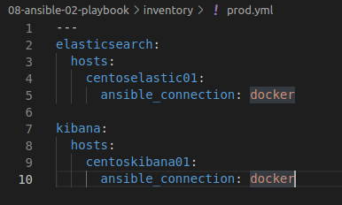
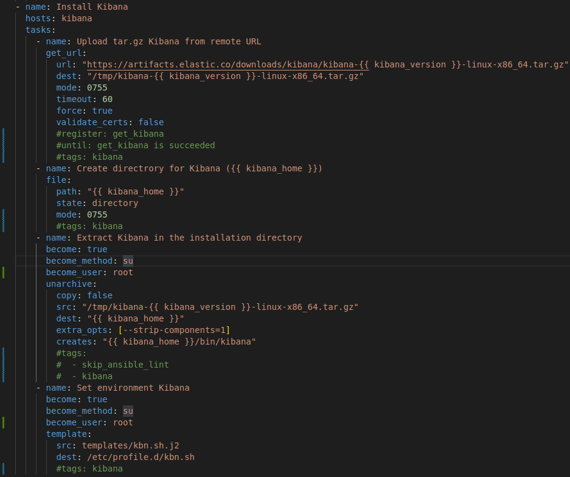
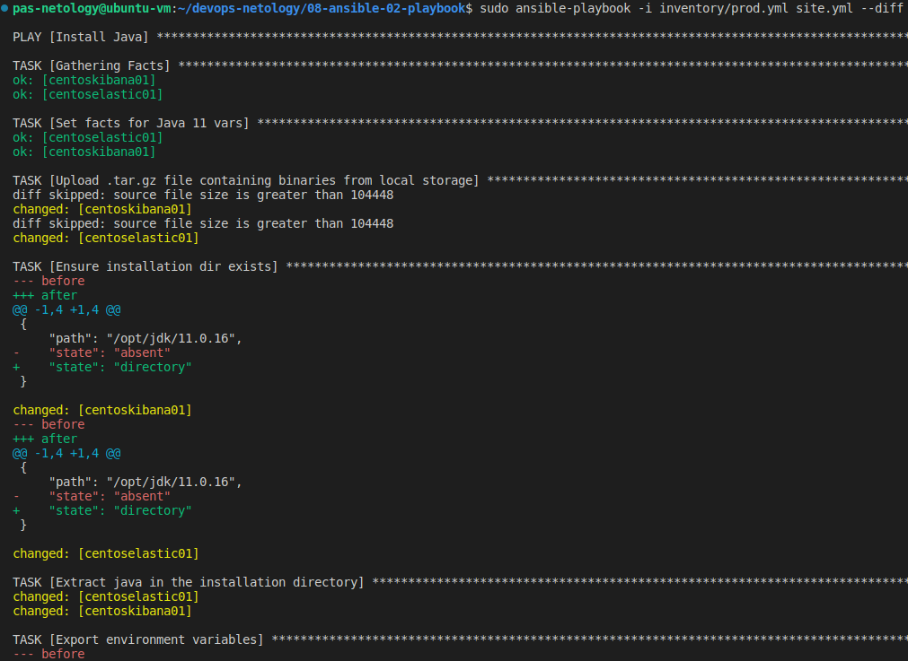
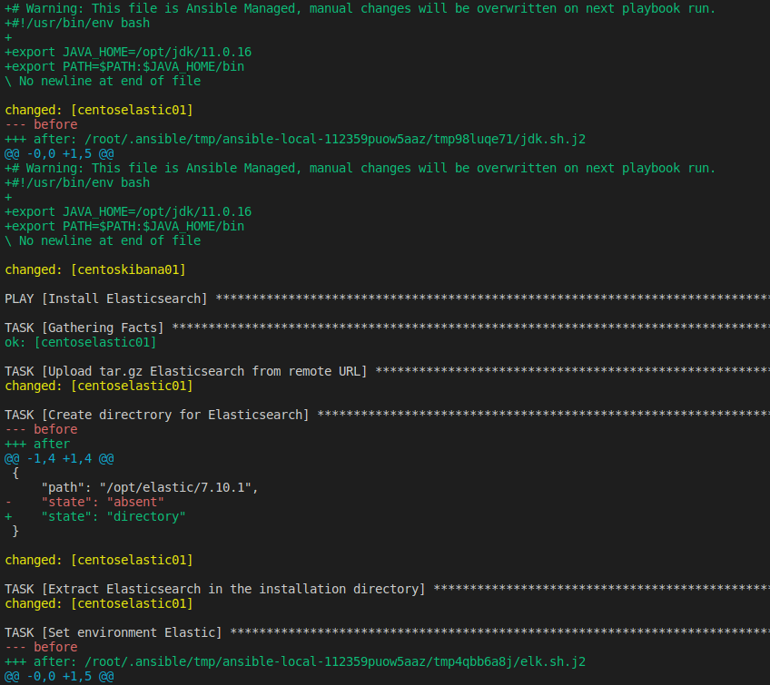
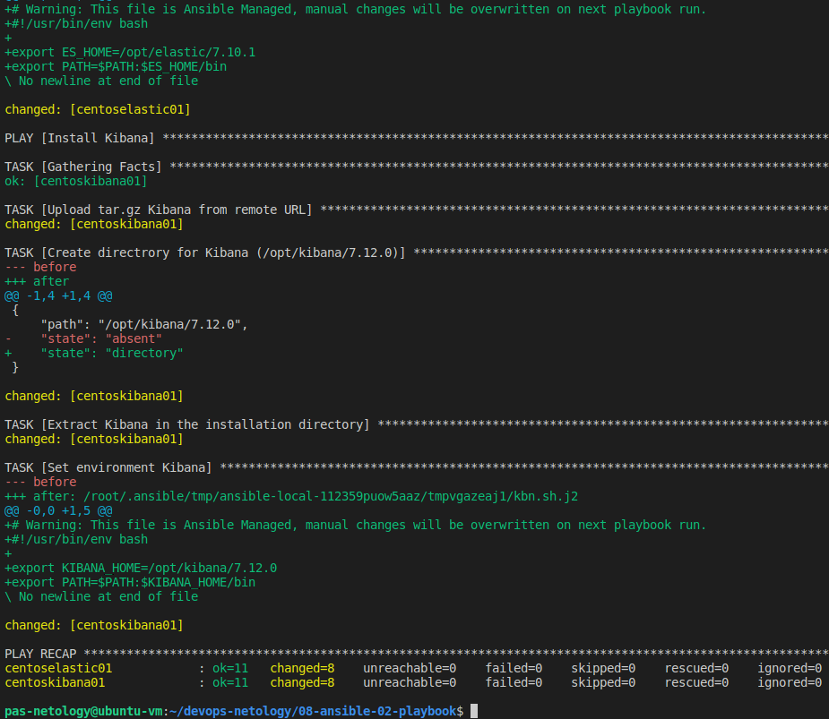

Домашняя работа занятию "08.02 Работа с Playbook"
==
1) Приготовьте свой собственный inventory файл prod.yml.

2) Допишите playbook: нужно сделать ещё один play, который устанавливает и настраивает kibana.

3) Выполнено
4) Выполнено
5) Запустите ansible-lint site.yml и исправьте ошибки, если они есть.

- Исправил отступы и ansible-lint отработал без ошибок
6) Попробуйте запустить playbook на этом окружении с флагом --check.
7) Запустите playbook на prod.yml окружении с флагом --diff. Убедитесь, что изменения на системе произведены.

- При первой попытке запуска появились ошибки, что в коде присутсвуют неподдерживаемые параметры. я принял решение их закомментировать. Версия Ansible 2.12.7
8) Повторно запустите playbook с флагом --diff и убедитесь, что playbook идемпотентен.
- playbook иденпотентен
9) Подготовьте README.md файл по своему playbook. В нём должно быть описано: что делает playbook, какие у него есть параметры и теги.
- Install Java
-
        установка тэгов
        установка переменных (facts)
        загрузка архива с JDK
        запуск таски от root
        создние рабочего каталога
        распаковка архива
        создание из шаблона переменных окружения
- Install Elastic
-
        установка тэгов
        загрузка архива с Elasticsearch
        запуск таски root
        создание рабочего каталога
        распаковка архива
        создание из шаблона переменных окружения
- Install Kibana
-
        установка тэгов
        загрузка архвиа с Kibana
        запуск таски от root
        создание рабочего каталога
        распаковка архива
        создание из шаблона переменных окружения
